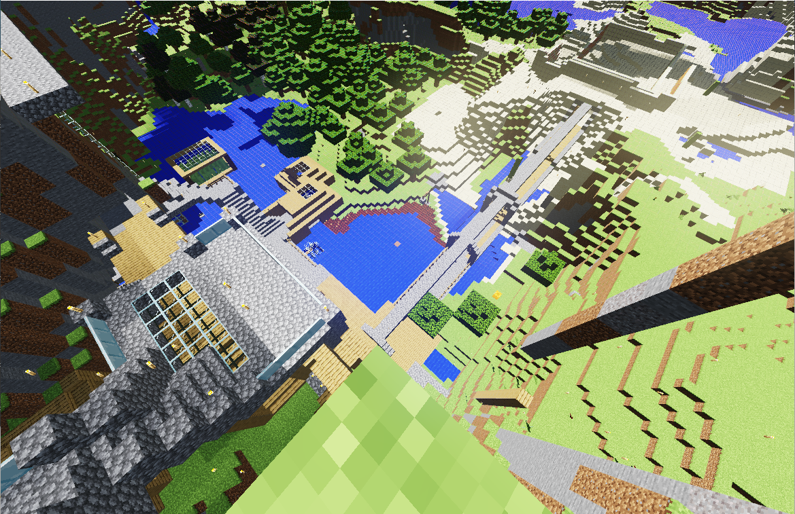
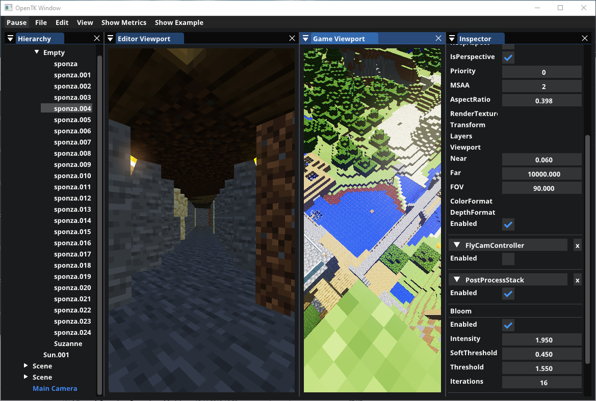

# BrickEngine
An Entity Component System Based game engine written in C# 

# Features
- Multi component Editing
- Custom performant Asset representation
- Extensible idiomatic interface
- Multiple backend rendering (Vulkan/DirectX 11/Metal)
- Fast Binary Serializers

# In Engine Images (Outdated)

- Gameplay view

- Editor view

